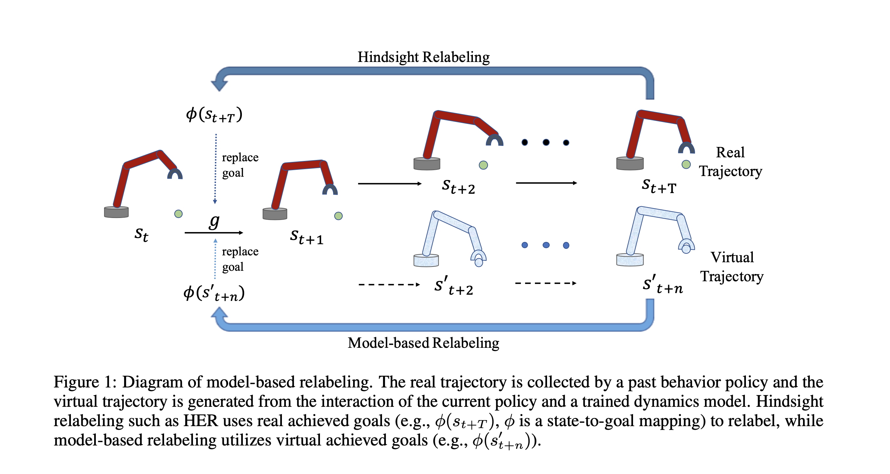

# Model-based Hindsight Experience Replay(MHER)
Code for Model-based Hindisight Experience Replay (MHER). MHER is a novel algorithm leveraging model-based achieved goals for both goal relabeling and policy improvement.

MHER can also be used for offline multi-goal RL, we revised the code based on WGCSL in the MHER_offline folder, where you can also find the offline datasets for all six environments used in our paper. To train offline MHER and other baselines, you can install the MHER_offline package and run it following the README file in MHER_offline folder. 

<div style="text-align: center;">

</div>


## Requirements
python3.6+, tensorflow, gym, mujoco, mpi4py

## Installation
- Clone the repo and cd into it:

- Install baselines package
    ```bash
    pip install -e .
    ```


## Usage
Environments: Point2DLargeEnv-v1, Point2D-FourRoom-v1, FetchReach-v1, SawyerReachXYZEnv-v1, Reacher-v2, SawyerDoor-v0.

MHER:
```bash
python -m  mher.run --env=Point2DLargeEnv-v1 --num_epoch 30 --num_env 1  --n_step 5 --mode dynamic --alpha 3 --mb_relabeling_ratio 0.8 --log_path=~/logs/point/ --save_path=~/logs/point/
```
MHER without MGSL (DDPG + MBR)
```bash
python -m  mher.run --env=Point2DLargeEnv-v1 --num_epoch 30 --num_env 1  --n_step 5 --mode dynamic --alpha 0 --mb_relabeling_ratio 0.8  --no_mgsl True 
```
MHER without MBR (DDPG + SL)
```bash
python -m  mher.run --env=Point2DLargeEnv-v1 --num_epoch 30 --num_env 1  --n_step 5 --mode dynamic --mb_relabeling_ratio 0.8  --no_mb_relabel True
```

DDPG:
```bash
python -m  mher.run  --env=Point2DLargeEnv-v1 --num_epoch 30 --num_env 1 --noher True 
```
HER:
```bash
python -m  mher.run  --env=Point2DLargeEnv-v1 --num_epoch 30 --num_env 1 
```
GCSL:
```bash
python -m  mher.run  --env=Point2DLargeEnv-v1 --num_epoch 30 --num_env 1 --mode supervised
```

Model-based Policy Optimization(MBPO):
```bash
python -m mher.run  --env=FetchReach-v1  --num_epoch 30 --num_env 1 --mode mbpo  --n_step 5
```

Model-based Value Expansion(MVE):
```bash
python -m mher.run  --env=FetchReach-v1  --num_epoch 30 --num_env 1 --mode mbpo  --n_step 5
```
