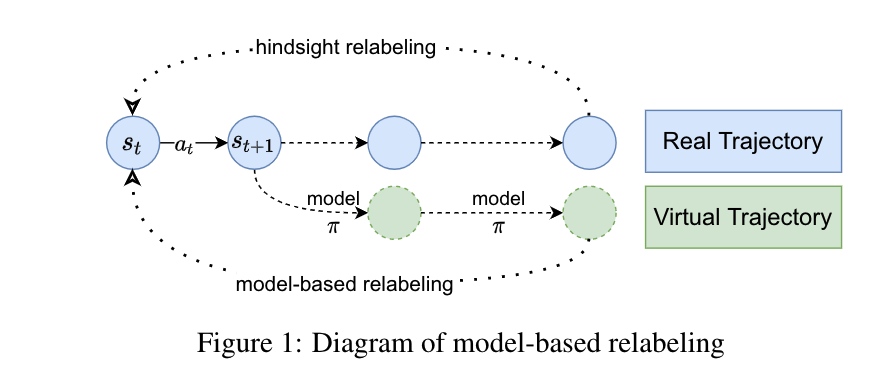

# Model-based Hindsight Experience Replay(MHER)
MHER utilizes model-based relabeling (MBR) and model-based goal-conditioned supervised learning (MGSL) to improve sample efficiency in multi-goal RL with sparse rewards.

<div style="text-align: center;">

</div>


## Requirements
python3.6+, tensorflow, gym, mujoco, mpi4py

## Installation
- Clone the repo and cd into it:

- Install baselines package
    ```bash
    pip install -e .
    ```


## Usage
Environments: Point2DLargeEnv-v1, Point2D-FourRoom-v1, FetchReach-v1, SawyerReachXYZEnv-v1, Reacher-v2
DDPG:
```bash
python -m  mher.run  --env=Point2DLargeEnv-v1 --num_epoch 30 --num_env 1 --noher True --log_path=~/logs/point/ --save_path=~/logs/ddpg/point/model/
```
HER:
```bash
python -m  mher.run  --env=Point2DLargeEnv-v1 --num_epoch 30 --num_env 1 
```
GCSL:
```bash
python -m  mher.run  --env=Point2DLargeEnv-v1 --num_epoch 30 --num_env 1 --mode supervised
```
MHER:
```bash
python -m  mher.run --env=Point2DLargeEnv-v1 --num_epoch 30 --num_env 1  --n_step 5 --mode dynamic --alpha 3 --mb_relabeling_ratio 0.8 
```
MHER without MGSL (DDPG + MBR)
```bash
python -m  mher.run --env=Point2DLargeEnv-v1 --num_epoch 30 --num_env 1  --n_step 5 --mode dynamic --alpha 0 --mb_relabeling_ratio 0.8  --no_mgsl True 
```
MHER without MBR (DDPG + MGSL)
```bash
python -m  mher.run --env=Point2DLargeEnv-v1 --num_epoch 30 --num_env 1  --n_step 5 --mode dynamic --mb_relabeling_ratio 0.8  --no_mb_relabel True
```
